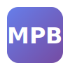

# MPB - Master Prompt Builder 🚀



**Crea tu Master Prompt personal para ChatGPT, Claude y cualquier AI.**

Una web app que te guía paso a paso para crear, mantener y exportar tu Master Prompt - un documento que captura quién eres, cómo trabajas y cómo te gusta recibir respuestas.

## ✨ Features

### 🎯 4 Formas de Empezar
- **Empezar de cero** - Wizard guiado con ejemplos clickeables
- **Importar Master Prompt** - Pega tu prompt existente y evoluciónalo
- **Importar de ChatGPT** - Usa tus memorias de ChatGPT
- **Importar de LinkedIn** - Pre-llena con tu perfil profesional (próximamente)

### 📝 Wizard de 7 Pasos
1. **Identidad** - Nombre, rol, empresa
2. **Contexto** - Industria, responsabilidades
3. **Stack** - Herramientas y tecnologías
4. **Comunicación** - Estilo de respuestas preferido
5. **Reglas** - Lo que siempre/nunca quieres
6. **Proyectos** - En qué estás trabajando
7. **Revisión** - Edita y finaliza

### 📤 Exportación
- 📋 Copiar al clipboard
- 📝 Descargar como Markdown (.md)
- 📄 Exportar a PDF con instrucciones
- 🤖 Versión optimizada para ChatGPT
- 🐙 Sincronización con GitHub (próximamente)

### 💾 Persistencia
- Guardado automático en localStorage
- Sistema de versiones
- Historial de cambios

## 🛠️ Tech Stack

- **Frontend**: Vanilla JavaScript (ES Modules)
- **Styling**: CSS Custom Properties + Glassmorphism
- **Storage**: localStorage
- **Sin dependencias externas** - Ligero y rápido

## 🚀 Cómo usar

### Desarrollo local

```bash
# Clonar el repositorio
git clone https://github.com/tu-usuario/master-prompt-builder.git
cd master-prompt-builder

# Iniciar servidor local
python3 -m http.server 3000
# o
npx serve .

# Abrir en el navegador
open http://localhost:3000
```

### Estructura del proyecto

```
Master Prompt Builder/
├── index.html              # Entry point
├── css/
│   ├── styles.css          # Design system + componentes
│   └── animations.css      # Animaciones y transiciones
├── js/
│   ├── app.js              # Aplicación principal
│   ├── wizard.js           # Manager del wizard
│   ├── generator.js        # Generador del prompt
│   ├── storage.js          # Persistencia local
│   ├── export.js           # Funciones de exportación
│   └── data.js             # Templates y ejemplos
├── assets/
│   └── favicon.svg         # Logo
└── README.md
```

## 📖 ¿Qué es un Master Prompt?

Un **Master Prompt** es tu "manual de usuario personal" para las IAs. Incluye:

- 👤 Quién eres (contexto personal/profesional)
- 🎯 Cómo piensas y trabajas
- 📁 Qué proyectos tienes activos
- 💬 Cómo te gusta recibir respuestas
- 🛠️ Tus herramientas y stack
- ⚡ Reglas y preferencias específicas

### ¿Por qué lo necesitas?

**El problema**: Cada vez que abres un chat nuevo con ChatGPT, tienes que explicar desde cero quién eres.

**La solución**: Un Master Prompt que pegas una vez y el AI ya sabe exactamente cómo ayudarte.

## 🔜 Roadmap

- [x] Wizard de 7 pasos
- [x] Ejemplos clickeables
- [x] Preview en tiempo real
- [x] Export a PDF/MD/Texto
- [x] Guardado local
- [ ] Autenticación (Supabase)
- [ ] Dashboard de admin
- [ ] GitHub Sync
- [ ] API pública
- [ ] Mobile app (PWA)

## 📄 Licencia

MIT © 2024

---

Hecho con ❤️ para la comunidad de AI
